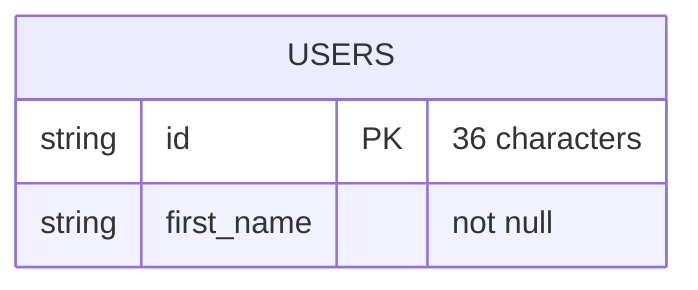
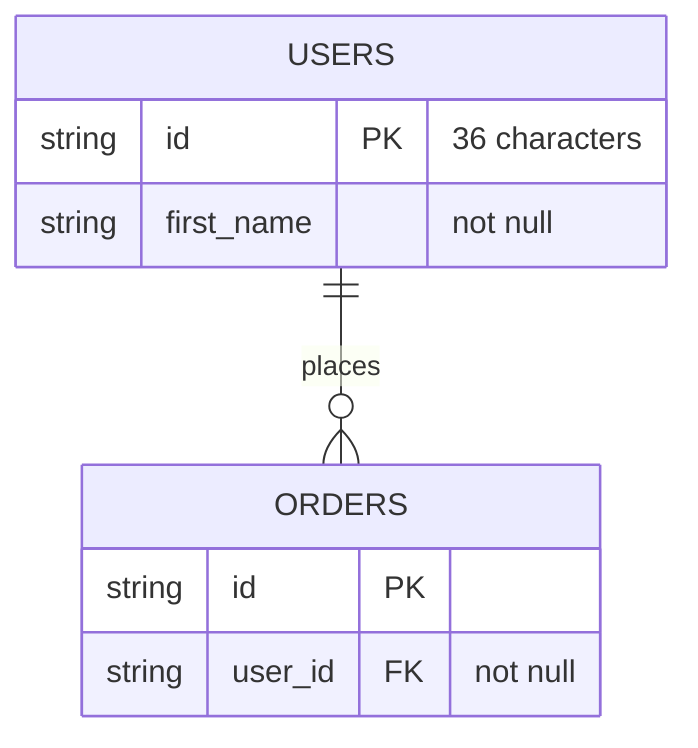

# Coding Standards

This document describes the main conventions for extending the No Idea backend.

---

## Adding config items

All configuration is loaded from `config.toml` and validated in `src/config.py`. New options must be registered in three places: the typed dataclass, the validation schema, and (usually) `config.toml.example`.

### 1. Define a typed field

Add the option to the appropriate frozen dataclass near the top of `config.py` (for example `Config`, or a nested type such as `LoggingConfig` / `DatabaseConfig`).

```python
@dataclass(frozen=True)
class Config:
    port: int
    api_key: str
    logging: LoggingConfig
    database: DatabaseConfig
    feature_flag: bool  # new top-level option
```

For a new nested group, add a dedicated dataclass and nest it under `Config` (or another parent).

### 2. Register it in `SCHEMA`

Every option needs a `ConfigOption` (or nested `ConfigSchema`) in the root `SCHEMA` object.

| Parameter | Purpose |
|---|---|
| `validator` | Returns `True` when the value is acceptable |
| `default_value` | Used when the key is missing (unless `required=True`) |
| `use_default_if_invalid` | Fall back to the default instead of raising on bad input |
| `required` | Fail if the key is absent |
| `post_validator_func` | Convert a valid value (e.g. `str` → `Path`, `str` → `Enum`) |

**Simple option example:**

```python
"feature_flag": ConfigOption(
    lambda x: isinstance(x, bool),
    default_value=False,
    use_default_if_invalid=True,
),
```

**Nested group example:**

```python
"logging": ConfigSchema({
    "file": ConfigOption(...),
    "level": ConfigOption(...),
}, lambda x: LoggingConfig(**x)),
```

Use `evaluate_if_empty=False` on nested schemas that should stay `None` when omitted (see `database.postgres`). Use `validator_func` on a `ConfigSchema` for cross-field checks (see `validate_correct_database_defined`).

### 3. Document it in `config.toml.example`

Add a commented entry so operators know the key name, type, and expected values.

### 4. Read it at runtime

```python
from src.config import get_config

value = get_config().feature_flag
```

Do not read `config.toml` directly elsewhere. Always go through `get_config()` after `parse_config()` has run at startup.

---

## Adding endpoints

HTTP routes live in dedicated modules under `src/endpoints/`. The shared FastAPI application is created once in `src/endpoints/api.py` (`api = FastAPI()`). Shared dependencies such as `verify_api_key` live in `src/endpoints/util.py`.

Each feature gets its own file with an `APIRouter`, for example `src/endpoints/tasks.py`. Do not add feature routes to `api.py` beyond mounting their routers.

### Pattern

1. Create or extend a module under `src/endpoints/` named for that area of the API.
2. Create a module-level router: `router = APIRouter(prefix="/task", tags=["tasks"])`.
3. Declare routes on that router (`@router.get`, `@router.post`, etc.).
4. Describe JSON bodies with a Pydantic model in that same file. Validate path, query, and body inputs with `Annotated`, `Path`, `Field`, and similar constraints.
5. Keep request/response shaping and HTTP errors in the endpoint.
6. Delegate business logic (database access, external APIs) to a module under `src/modules/`.
7. Mount the router from `src/endpoints/api.py` with `api.include_router(...)`.
8. Protect privileged routes with `dependencies=[Depends(verify_api_key)]`, importing `verify_api_key` from `src.endpoints.util`. Clients must send the `x-api-key` header matching `config.api_key`.

**Dedicated endpoint module:**

```python
router = APIRouter(prefix="/user", tags=["users"])


@router.get("/{user_id}")
async def get_user(user_id: Annotated[str, Path(min_length=36, max_length=36)]):
    try:
        user = users.get_user(user_id)
        return {"first_name": user.first_name}
    except KeyError as e:
        raise HTTPException(status_code=404, detail=str(e))
```

**Mount the router** in `src/endpoints/api.py`:

```python
api.include_router(tasks_router)
api.include_router(users_router)
```

### Guidelines

- One concern per endpoint file (tasks, users, and so on).
- Map domain errors from modules (e.g. `KeyError`) to appropriate `HTTPException` status codes.
- Do not put SQLAlchemy queries or provider SDK calls directly in endpoint modules.
- Feature modules import `verify_api_key` from `util.py` and expose an `APIRouter`. They must not import the FastAPI `api` instance. Mount routers from `api.py` so imports stay acyclic.
- Optionally add a request to `test_main.http` for manual checks.

---

## Adding SQL database tables

Every schema change is made in three places, in the same change:

1. `src/modules/db_schema.py` — SQLAlchemy ORM models. This is the source of truth used to create tables.
2. `docs/db_schema.md` — Mermaid entity-relationship diagram of the same schema.
3. `scripts/seed.sql` — Sample insert data used by `scripts/setup_db.py`.

The diagram and seed data must match the models. Do not add or alter a table in only one of these files.

### 1. Define the model in `db_schema.py`

ORM models use modern SQLAlchemy 2.0 Declarative style.

1. Subclass `Base` (the shared `DeclarativeBase`).
2. Set `__tablename__`.
3. Declare columns with `Mapped[...]` and `mapped_column(...)`.
4. Add `ForeignKey` and `relationship(...)` only when there is a real link between models.
5. Ensure the model module is imported before `Base.metadata.create_all` runs (via `NoIdeaApp.validate_database()`), so the table is registered on metadata.

**Example:**

```python
class User(Base):
    """A registered user."""

    __tablename__ = "USERS"

    id: Mapped[str] = mapped_column(String(36), primary_key=True)
    first_name: Mapped[str] = mapped_column(String, nullable=False)
```

**Guidelines:**

- Prefer `Mapped[T]` / `mapped_column` over legacy `Column`-only style on classes.
- Use `Mapped[T | None]` for nullable fields.
- Table creation is handled through `Base.metadata.create_all(self.db_engine)` in `app.py`; do not create tables ad hoc in modules.
- Keep schema definitions in `db_schema.py`; keep query helpers in domain modules (e.g. `users.py`).

### 2. Update the ER diagram in `docs/db_schema.md`

`docs/db_schema.md` holds a single Mermaid `erDiagram` of the current database. Add or edit entities there whenever `db_schema.py` changes.

**Conventions:**

- One entity per table. The entity name matches `__tablename__` (for example `USERS`).
- One attribute per column, in the same order as the model.
- Use a Mermaid type that matches the column: `string`, `int`, `float`, `boolean`, `date`, or `datetime`.
- Mark keys with `PK`, `FK`, or `UK`.
- Put constraints the type does not show in a trailing comment: length, `not null`, and defaults.
- Draw one relationship line per foreign key. Use Mermaid cardinality (`||--||`, `||--o{`, `}|--|{`, and so on). Label the line with the relationship name.

**Example** (matches the `User` model above):



When a later table references `USERS.id`, add both the new entity and the relationship in `docs/db_schema.md`:



### 3. Update seed data in `scripts/seed.sql`

`scripts/seed.sql` holds the sample rows loaded by `scripts/setup_db.py` after tables are created. Whenever `db_schema.py` changes, update the seed script in the same change so local and demo databases stay valid.

**Conventions:**

- Quote table and column names to match `__tablename__` and the ORM column names (for example `"USERS"`, `"id"`).
- Keep `DELETE` statements in reverse foreign-key order, then `INSERT` statements in dependency order (parents before children).
- Include every non-nullable column on each insert; nullable columns may be omitted or set to `NULL`.
- Respect length limits and check constraints from the models (for example ratings 1–5, category names ≤16 characters).
- Prefer fixed 36-character ids so seed data is stable across re-runs.
- Do not put schema DDL (`CREATE TABLE`, and so on) in `seed.sql`; table creation stays with `Base.metadata.create_all` via `setup_db.py` / the app.

---

## Adding demos

Manual demonstration scripts and end-to-end harnesses live under `demo/` at the backend root. They are not pytest suites (`test/` stays for automated CI tests) and they are not part of the runtime package (`src/`).

### Pattern

1. Add a new script under `demo/`, named for what it shows (for example `demo_loop.py`, `ai_smoke_test.py`).
2. Keep demos self-contained: parse config, initialise the app if needed, then call into `src.modules` the same way production code would.
3. Prefer printing clear stage-by-stage output so a human can follow the flow on stage or while debugging prompts.
4. Document how to run the script in its module docstring, including any prerequisites (for example `python scripts/setup_db.py` or an `[ai]` API key).
5. Run demos from the backend root so `./images`, `config.toml`, and imports of `src` resolve correctly:

```bash
python demo/demo_loop.py
```

### Guidelines

- One concern per demo script (full product loop, AI smoke pass, fake-provider parse checks, and so on).
- Demos may use the real database and seed data; reset only the rows they own so re-runs stay repeatable.
- Do not put demo-only helpers or fixtures into `src/` unless production code also needs them.
- Prefer graceful behaviour without secrets when practical (for example AI deterministic fallbacks) so a demo still runs offline; say so in the docstring.
- Do not register `demo/` scripts with pytest. CI continues to run only `test/`.
- When docs mention a demo, point at the path under `demo/` (for example `python demo/demo_loop.py`).

---

## Interacting with the database and external providers (modules)

All non-HTTP integration work belongs under `src/modules/`. Endpoints call modules; modules talk to the database or external services.

### Layout

| Layer | Responsibility |
|---|---|
| `src/endpoints/api.py` | FastAPI app, CORS, and `include_router` for feature routers |
| `src/endpoints/util.py` | Shared endpoint dependencies (e.g. `verify_api_key`) |
| `src/endpoints/*.py` | One `APIRouter` per domain, HTTP status codes, response JSON |
| `src/modules/*.py` | Domain operations (users, future providers, etc.) |
| `src/modules/db_schema.py` | ORM table definitions only |
| `src/app.py` | Shared app singleton, including `db_engine` |

### Database access

1. Obtain the engine from the app singleton: `app().db_engine`.
2. Run SQLAlchemy statements inside a connection/session context.
3. Return plain domain objects (e.g. dataclasses) or ORM instances as appropriate for callers.
4. Raise clear domain errors (e.g. `KeyError` when a row is missing) and let the API layer translate them to HTTP responses.

**Illustrative module shape:**

```python
from sqlalchemy import select
from sqlalchemy.orm import Session

from src.app import app
from src.modules.db_schema import User as UserRow


def get_user(user_id: str) -> User:
    with Session(app().db_engine) as session:
        result = session.scalar(select(UserRow).where(UserRow.id == user_id))
        if result is None:
            raise KeyError(f"User '{user_id}' not found.")
        return User(result.id, result.first_name)
```

Prefer SQLAlchemy constructs (`select`, `Session`) over raw SQL. Avoid string-built queries.

### External providers

Treat third-party APIs the same way as the database:

1. Add a dedicated module (e.g. `src/modules/payments.py`) for that provider.
2. Put API keys, base URLs, and timeouts in `config.py` / `config.toml` — never hard-code secrets.
3. Expose small functions the API (or other modules) can call.
4. Log failures with the module logger; raise domain-specific errors for the API layer to map to HTTP status codes.

### Guidelines

- One concern per module file (users, a single provider, etc.).
- Modules may import `app()` and `get_config()`; they should not import FastAPI route objects.
- Keep side effects (network I/O, commits) inside the module functions that own them.
- Use module-level loggers: `logging.getLogger(__name__)`.
