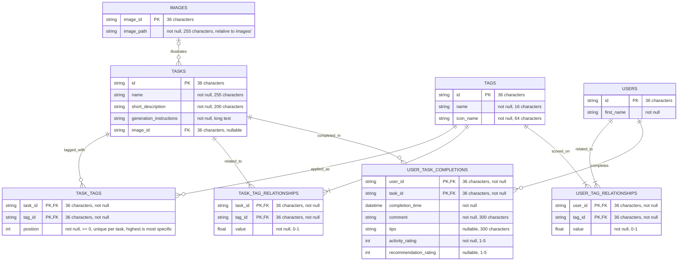

# Database schema

Entity-relationship diagram for the No Idea backend. Table and column definitions live in `src/modules/db_schema.py`. When the schema changes, update this diagram and `scripts/seed.sql` in the same change. See [Adding SQL database tables](code_standards.md#adding-sql-database-tables).

